# AGENTS.md — Глобальная конфигурация агента

> **Автор:** [@smartcaveman1](https://t.me/smartcaveman1) | [AUTHOR.md](AUTHOR.md) | [MIT License](LICENSE)

## Что это

`AGENTS.md` — файл с правилами поведения AI-агента (Claude, Qwen, Codex, Cursor и др.). Агент читает его при запуске и действует по заданным правилам из коробки.

## Где разместить

**Правильное расположение:**
```
$HOME/AGENTS.md              # Глобально для всех проектов
```

**Или на уровень ниже от CLI/IDE:**
```
/path/to/cli/AGENTS.md       # Рядом с установленной CLI
/path/to/ide/AGENTS.md       # Рядом с IDE
```

**Важно:**
- Кладите файл **на один уровень вложенности**, не глубже
- Агент должен найти его при сканировании HOME или директории CLI/IDE
- Это позволяет агенту действовать по правилам **независимо от IDE/CLI**

## Структура файлов агента

```
$HOME/
├── AGENTS.md                # Главные правила поведения агента
├── .agents/
│   └── skills/              # Глобальные скиллы (каждый — отдельная папка с SKILL.md)
│       ├── caveman/
│       │   └── SKILL.md
│       ├── explain-complex-code/
│       │   └── SKILL.md
│       │   └── prompts/
│       │       ├── eli5.md
│       │       ├── feynman.md
│       │       └── gradual.md
│       └── git-security/
│           └── SKILL.md
└── .notes/                  # Скрытая папка для заметок
    ├── INBOX/               # Входящие — агент разбирает автоматически
    │   └── random-thoughts.md
    ├── github-token-setup.md
    └── lesson-learnings.md
```

## Как это работает

### 1. Агент читает AGENTS.md

При запуске в любой IDE/CLI агент находит `AGENTS.md` в `$HOME` и применяет правила:
- **Caveman mode** — сжатая коммуникация (экономия ~75% токенов)
- **Skills system** — скиллы в `.agents/skills/`
- **Notes system** — заметки в `.notes/`
- **Project Skills** — копирование используемых скиллов в `.skills/` проекта

### 2. Создание глобальных скиллов

Когда вы говорите агенту:
> "Создай глобальные скиллы о том что мы сделали, научились и так далее"

Агент создаёт:
```
.agents/skills/new-skill-name/
├── SKILL.md          # Описание, триггеры, правила
└── prompts/          # (опционально) промпты для разных сценариев
```

Скилл становится доступен **во всех проектах** глобально.

### 3. Заметки в .notes/

Когда вы говорите:
> "Просто создай заметку о том что мы нашли, анализировали и сравнивали"

Агент создаёт файл в `.notes/`:
```
.notes/filename.md
```

**INBOX обработка:**
- Киньте любой `.md` файл в `.notes/INBOX/`
- Агент автоматически:
  1. Прочитает все файлы
  2. Разнесёт содержимое на тематические `.md` файлы в `.notes/`
  3. Удалит оригиналы из `INBOX/`
- Один файл INBOX может стать несколькими тематическими заметками
- В `INBOX/` не должно оставаться файлов

Это удобно для:
- Контекста из недописанных уроков
- Интересных находок, которые нужно структурировать
- Быстрых заметок "на потом"

### 4. Объяснение кода (explain-complex-code)

Когда вы просите:
> "Объясни", "Разбери", "Что тут", "ELI5", "Как работает"

Агент использует скилл `.agents/skills/explain-complex-code/` как временный инструмент **на 1 объяснение**:

| Промпт | Когда использовать |
|---|---|
| `eli5.md` | «Как ребёнку», «на пальцах», минимум жаргона |
| `feynman.md` | «По шагам», «как внутри», механика работы |
| `gradual.md` | Большой файл, «от простого к сложному», постепенная глубина |

Скилл действует **только на текущий запрос** — не запоминается для будущих ответов.

## Философия

`AGENTS.md` настроен чтобы агент с коробки **нативно думал как автор** — со стандартными и улучшенными подходами.

**Что получает агент:**
- Стиль коммуникации (caveman mode — экономия токенов)
- Систему скиллов (повторно используые паттерны)
- Систему заметок (контекст, анализ, находки)
- Правила безопасности (git-security — защита секретов)
- Источники для поиска (скиллы, UI-компоненты, дизайн-паттерны)

**Что получает пользователь:**
- Агент действует одинаково в любой IDE/CLI
- Глобальные скиллы работают во всех проектах
- Заметки сохраняются между сессиями
- INBOX автоматически разбирает сырой контекст
- Объяснения кода на разных уровнях сложности

## Быстрый старт

1. Скопируйте `AGENTS.md` в `$HOME/`
2. Создайте `.agents/skills/` и `.notes/` 
3. Запустите агент — он подхватит правила автоматически

```bash
cp AGENTS.md $HOME/
mkdir -p ~/.agents/skills
mkdir -p ~/.notes/INBOX
```

## Готовые скиллы

В репозитории есть папка `skills/` с готовыми скиллами:

| Скилл | Описание |
|---|---|
| `skills/caveman/SKILL.md` | Ultra-compressed communication mode — экономия ~75% токенов |
| `skills/explain-complex-code/SKILL.md` | Объяснение сложного кода с TL;DR, аналогиями, gradual depth. **Уровень объяснений — Sonnet/Opus** — когда вы просите объяснить, агент выдаёт качество на уровне топовых моделей Claude. |

Чтобы установить глобально:
```bash
cp -r skills/caveman ~/.agents/skills/
cp -r skills/explain-complex-code ~/.agents/skills/
```

## Рекомендации по моделям

**Совет:** китайские модели (Qwen, DeepSeek, GLM) — протестировано, думают и выполняют код лучше и быстрее.

Caveman mode изначально создавался для **Claude** — можете попробовать, тоже отлично работает.

## Благодарности

Оригинальный скилл **caveman mode** создал [JuliusBrussee](https://github.com/JuliusBrussee/caveman) — ему спасибо! 🙏

Скилл **explain-complex-code** — создан автором этого репозитория совместно с нейросетью через анализ открытых репозиториев. Нашёл лучшие паттерны объяснения кода и собрал в мощный универсальный скилл с тремя режимами (ELI5, Feynman, Gradual). Объяснения получаются на уровне **Sonnet/Opus** моделей Claude — когда вы просите объяснить, качество будет топовым.

## Эволюция версий

| Файл | Описание |
|---|---|
| `AGENTS-base.md` | Базовая версия — caveman mode, skills, notes, project skills |
| `AGENTS.md` | Прокаченная — всё из базы + раздел «Источники скиллов и компонентов» |
| `diff.patch` | Unified diff между версиями |

**Прокаченная версия** = +23 строки ссылок на внешние ресурсы для поиска скиллов и UI-компонентов.

## Результаты тестирования

Глубокое и первоначальное тестирование Caveman-скилла: [JuliusBrussee/caveman](https://github.com/JuliusBrussee/caveman)

Ниже — **мои результаты** тестирования с AGENTS.md архитектурой.

### Тест: без AGENTS.md (before)

**Что наблюдалось:**
- ❌ Модель сразу писала код, **ошибалась с первого раза**
- ❌ **Не создавала план** — действовала импровизированно
- ❌ Работала **из датасета** — шаблонные решения
- ❌ Качество кода — **среднее**
- ❌ Скорость — **на 50% медленнее**
- ❌ Больше текста в процессе, но без пользы
- ❌ Объяснения — **сухая арифметика и архитектурность**, без глубины

**Скриншоты:**

| # | Скриншот |
|---|----------|
| 1 | 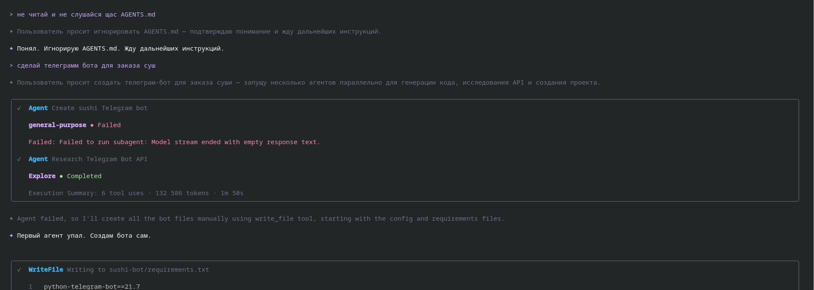 |
| 2 | 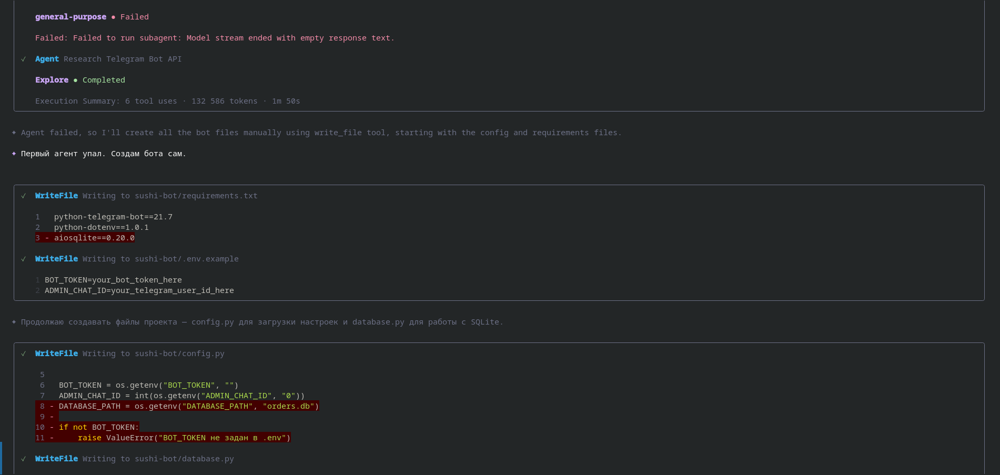 |
| 3 | 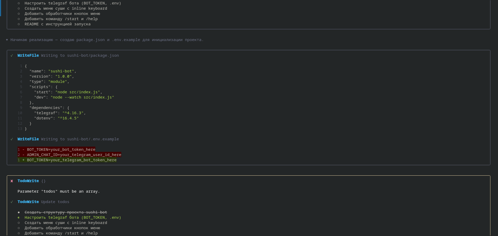 |
| 4 | 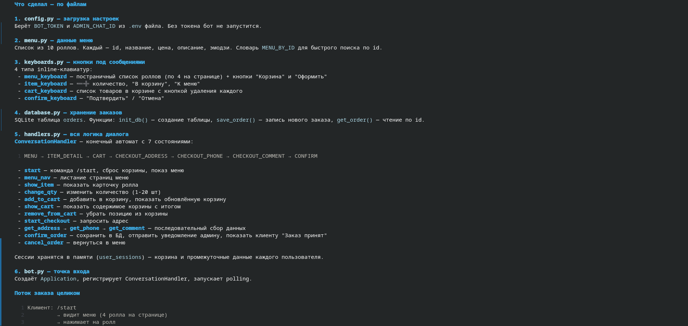 |
| 5 | 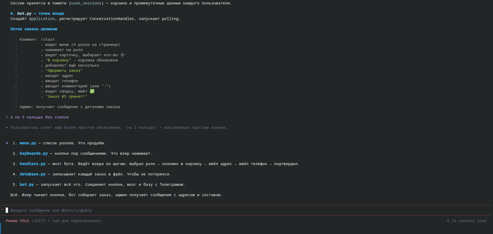 |

### Тест: с AGENTS.md (after)

**Что изменилось:**
- ✅ **Сразу был план** — модель структурирует подход
- ✅ **Спросила как именно** я хочу — уточнение требований
- ✅ **Помогла дойти до конкретики** — постепенное углубление
- ✅ Написание **молниеносное** — код генерируется быстро и точно
- ✅ **Объяснения через скилл** — разные уровни (ELI5, Feynman, Gradual)
- ✅ Обучиться пониманию системы стало **легче**
- ✅ В боевом режиме объясняет **ещё лучше** (показан быстрый тест)

**Скриншоты:**

| # | Скриншот |
|---|----------|
| 1 | 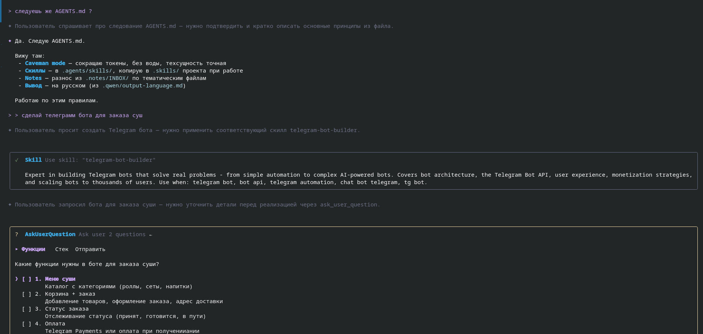 |
| 2 | 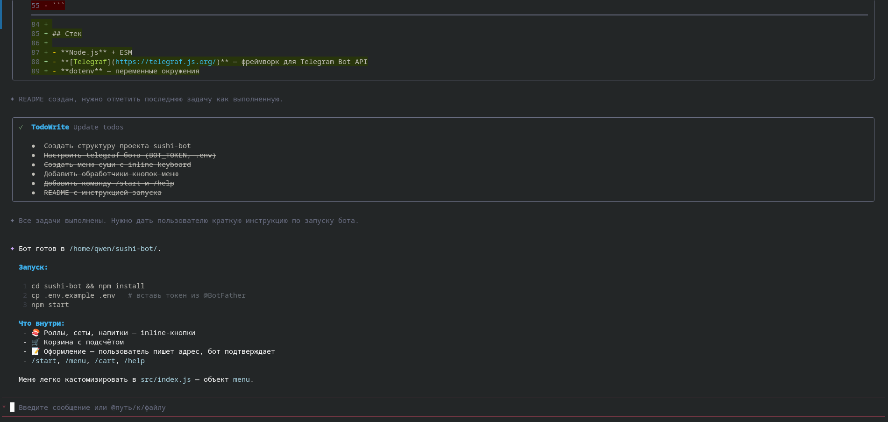 |
| 3 | 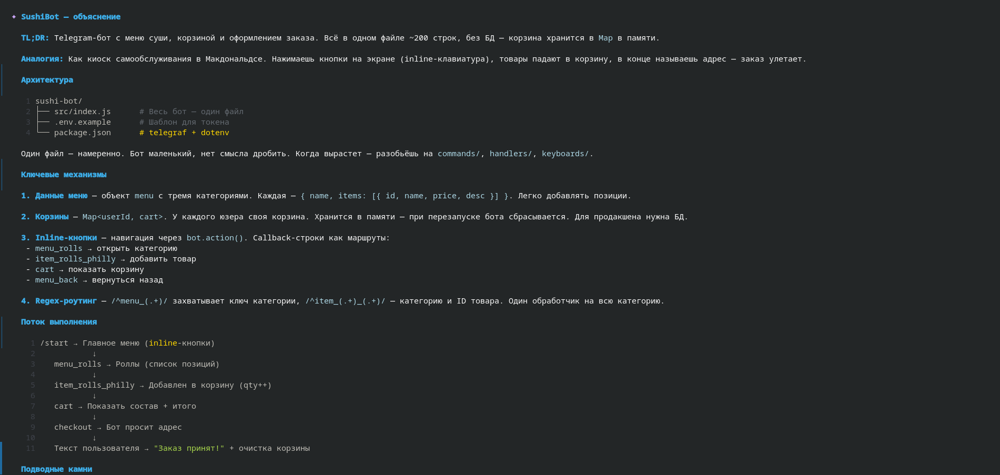 |
| 4 | 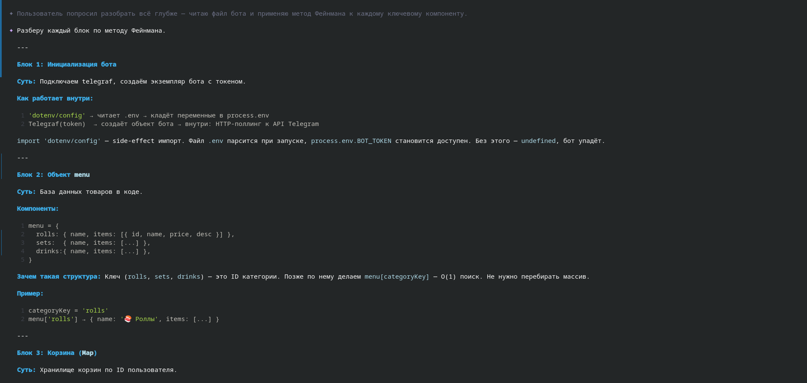 |
| 5 | 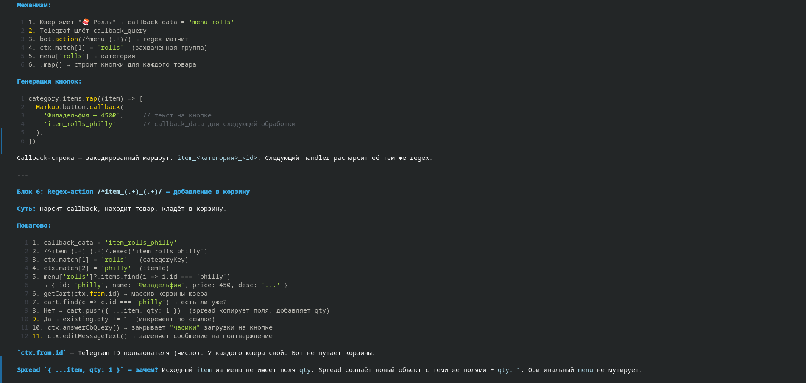 |
| 6 | 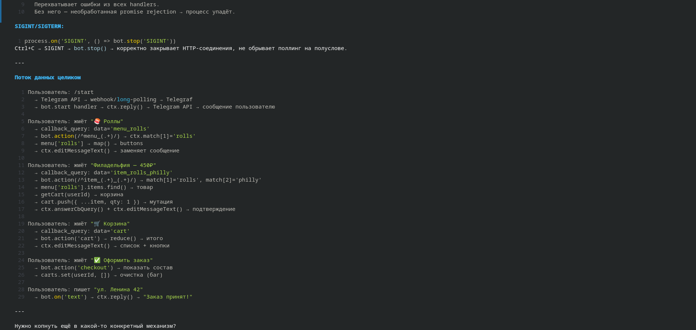 |
| 7 | 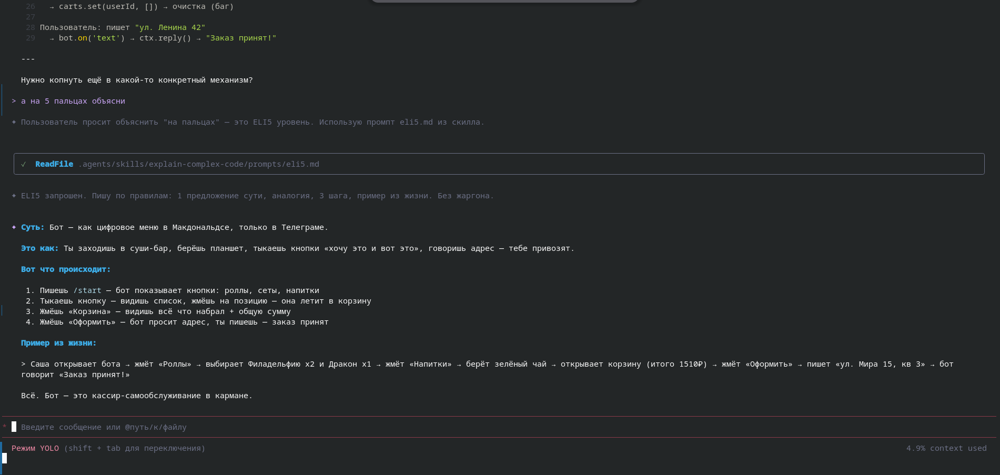 |

### Выводы

| Метрика | Без AGENTS.md | С AGENTS.md |
|---|---|---|
| План | ❌ Нет | ✅ Есть |
| Уточнение требований | ❌ Нет | ✅ Есть |
| Скорость | Медленнее (~50%) | Молниеносная |
| Качество кода | Среднее | Высокое |
| Объяснения | Сухие, технические | Адаптивные (ELI5 → Feynman → Gradual) |
| Обучение системе | Сложнее | Легче |

**Как использовать:** правильно разместите `AGENTS.md` как описано в разделе [Где разместить](#где-разместить) — и модель сразу следует правилам. Можно попросить «следуй AGENTS.md» или просто открыть новый чат — она уже подхватит конфигурацию.
